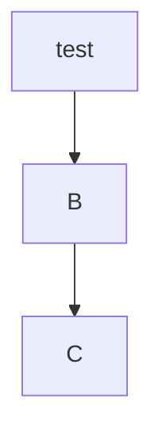

## 1.1 자료구조와 알고리즘

### 자료구조란?

> **자료구조**란 데이터를 효율적으로 저장하고 관리하기 위한 구조적 방식  
  

코딩은 자료(data)를 주로 다루며, 이런 자료를 정리하여 보관하기 위해 여러 가지 구조들이 사용됩니다.  
이를 **자료 구조(data structure)**라고 합니다.



위 예시들처럼, **자료구조**는 자료의 특성에 따라 <u><em>효율적인 정리 규칙</em></u> 을 찾아 정리하고, <u><em>저장 및 처리</em></u> 하는 모든 작업을 다룹니다.

```mermaid
graph TD;
    A[test] --> B;
    B --> C;
```