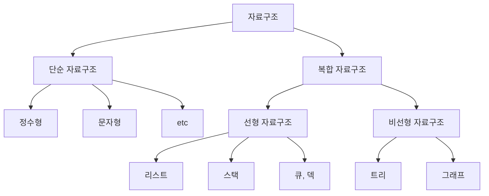

## 1.1 자료구조와 알고리즘

### 자료구조란?

> **자료구조**란 데이터를 효율적으로 저장하고 관리하기 위한 구조적 방식  
  

코딩은 자료(data)를 주로 다루며, 이런 자료를 정리하여 보관하기 위해 여러 가지 구조들이 사용됩니다.  
이를 **자료 구조(data structure)**라고 합니다.



위 예시들처럼, **자료구조**는 자료의 특성에 따라 <u><em>효율적인 정리 규칙</em></u> 을 찾아 정리하고, <u><em>저장 및 처리</em></u> 하는 모든 작업을 다룹니다.

#### 자료구조의 분류 


```mermaid
flowchart TD
    A[자료구조] --> B[단순 자료구조]
    A --> C[복합 자료구조]
    B --> D[정수형]
    B --> E[문자형]
    B --> F[etc]
    C --> G[선형 자료구조]
    C --> H[비선형 자료구조]
    G --> I[리스트]
    G --> J[스택]
    G --> K[큐, 덱]
    H --> L[트리]
    H --> M[그래프]
```
자료구조는 크게 **단순 자료구조**와 **복합 자료구조**로 나눌 수 있습니다. 이름처럼 **단순 자료구조**는 숫자나 문자와 같은 단순한 자료를 저장하는 구조이고, **복합 자료구조**는 여러 개의 단순 자료를 한꺼번에 보관하는 구조입니다.  
**복합 자료구조**는 다시 **선형 자료구조**(linear)와 **비선형 자료구조**(non-linear)로 나눌 수 있습니다.   
<br>
**선형 자료구조**는 자료들을 <u>일렬로 나열하여 저장</u>하는데, 자료들 사이에 <u>순서</u>가 존재합니다.  
**비선형 자료구조**는 한 줄로 세우기 어려운 <u>복잡한 관계</u>의 자료들을 표현할 수 있습니다.  
<br>
모든 자료구조는 배열을 이용하거나 연결된 구조로 구현할 수 있습니다. 
<br>
컴퓨터의 가장 대표적인 응용 분야는 정렬과 탐색입니다.
**정렬**은 주어진 데이터 집합을 특정 기준에 맞게 순서대로 나열하는 작업이며, **탐색**은 주어진 데이터 집합에서 특정 값을 찾는 작업입니다.  
정렬과 탐색을 효율적으로 수행하기 위해서는 적절한 자료구조를 사용하는 것이 매우 중요합니다. 가령, 정렬된 배열에서는 이진 탐색을 활용하면 O(log n)의 시간 복잡도로 탐색할 수 있지만, 정렬되어 있지 않은 배열에서는 선형 탐색을 사용하므로 O(n)의 시간 복잡도가 필요합니다.  



### 알고리즘이란?
대부분의 컴퓨터 프로그램은 어떤 데이터를 처리하고 그 결과를 제공합니다.
이때 데이터는 자료구조를 이용하여 표현되고, 이를 이용해 주어진 문제를 처리하기 위한 효과적인 절차가 필요한데, 이를 **알고리즘(algorithm)**이라고 합니다.  
예를 들어 영어 사전에서 특정한 단어를 찾는 방법(알고리즘)을 알아보겠습니다.  
- 방법 1: 사전의 첫 페이지부터 차레대로 읽어가며 찾기
- 방법 2: 사전의 단어들이 알파벳순으로 정렬되어 있으므로, 첫 알파벳 글자를 기준으로 페이지를 나누어 찾기  

단어들이 배열에 저장되어 있다면 배열이 자료구조에 해당하고, 찾는 위 두 가지 방법이 알고리즘이 됩니다.  
당연하게도 방법 2가 더 좋은 알고리즘인데, 이 경우를 통해 더 복잡한 자료구조를 사용하면 더 좋은 알고리즘을 사용할 수 있다는 것을 알 수 있습니다.

#### 알고리즘의 조건  
**알고리즘**은 주어진 문제를 해결하기 위한 <u>논리적인 절차와 방법들</u>을 정리한 것으로, 컴퓨터에서는 <u>특정 작업을 수행하는 명령어들의 집합</u>입니다. 
이 명령어들은 컴퓨터가 실행하는 구체적인 명령들을 의미합니다.  
> **알고리즘의 조건**
> - 입력 : 0개 이상의 입력이 존재  
> - 출력 : 1개 이상의 출력이 존재  
> - 명백성 : 각 명령어의 의미는 모호하지 않고 명확  
> - 유한성 : 한정된 수의 단계 후에는 반드시 종료  
> - 유효성 : 각 명령어들은 실행 가능한 연산  

#### 알고리즘의 기술 방법  
1. 자연어  
2. 흐름도(flowchart)  
3. 의사코드(pseudocode)  
4. 특정 프로그래밍 언어  

## 1.2 추상 자료형  
### 추상 자료형(Abstract Data Type, ADT)이란?  
> **추상 자료형**이란 개발자가 추상적으로 정의한 자료형으로, 자료구조가 어떤 자료를 다루는지 그리고 이들에 대해 어떤 연산이 제공되는지 기술  



위 예시처럼 데이터와 연산이 정해지면 추상 자료형을 정의할 수 있습니다. 
추상 자료형은 사용자 프로그램에게는 인터페이스(Interface)만 제공하고, 내부 구현은 숨기는 특징이 있습니다. 
즉, 사용자는 Bag의 연산들이 어떻게 구현되었는지를 몰라도 Bag를 쉽게 사용할 수 있다는 의미입니다.  

추상 자료형은 일반 함수보다는 클래스로 구현하는 것이 바람직합니다. 
추상 자료형의 데이터와 연산이 클래스의 상태(state)와 행위(behavior)에 정확히 대응되기 때문입니다. 

## 1.3 알고리즘의 성능 분석  
### 알고리즘의 실행시간 측정  

알고리즘의 효율성은 <u>계산속도</u>와 <u>메모리 사용량</u>으로 평가가 가능합니다. 
즉, 좋은 알고리즘은 실행시간이 짧으면서 메모리와 같은 컴퓨터의 자원들을 적게 사용하는 것입니다. 
일반적으로 실행시간이 메모리 공간보다 더 중요하게 인식되므로 <u>실행시간을 효율적인 알고리즘의 기준</u>으로 삼습니다. 
이러한 알고리즘의 효율성은 자료들을 어떤 구조로 관리하는지, 즉 사용하는 자료구조에 따라 큰 영향을 받습니다.  

알고리즘의 효율성을 판단하는 가장 확실한 방법은 알고리즘을 구현하여 실제로 컴퓨터로 실행시켜, 실행시간을 측정하는 것입니다. 
이때, `import time` 모듈을 사용하기도 합니다.  



### 알고리즘의 복잡도 분석이란?  
알고리즘의 **복잡도 분석(complexity analysis)**은 구현하지 않고 알고리즘의 효율성을 평가하는 방법입니다. 
처리시간을 직접 측정하는 것이 아니라 <u>알고리즘의 연산 횟수를 대략적으로 계산</u>하는데, 더 많은 연산이 필요하면 더 복잡한 알고리즘이 됩니다.  

알고리즘의 복잡도를 계산하기 위해서는 먼저 얼마나 많은 연산이 실행되는지를 계산해야 합니다. 
보통 이러한 <u>연산들의 실행 횟수는 입력의 크기 n에 대한 함수</u> 형태, 즉 <em>T(n)</em> 으로 나타나는데, 이를 **복잡도 함수**라고 합니다.  

두 가지 예시 코드에 대해 복잡도 함수를 구해보겠습니다.  
```python
# 반복문을 이용해 숫자를 하나씩 더하기 
calc_sum(n):
    sum = 0
    for i in range(1, n+1):
        sum += i
    return sum
```

위 코드의 경우, 3행에서 대입 연산(sum = 0)이 1회 실행됩니다. 또한, 5행(sum += i)은 반복문(for) 내부에 있어 n번 수행되며, 대입 연산과 덧셈 연산이 한 번씩 수행됩니다.(4행의 반복 제어와 6행의 결과 반환 연산은 전체 복잡도에 영향을 미치지 않으므로 무시)  
결국, 3행과 5행의 연산들의 실행 횟수를 모두 합하면 2n + 1이 되고, 이 알고리즘의 복잡도 함수 <em>T(n)</em>=2n+1이 됩니다.  

```python
# 합 공식으로 1부터 n까지 합을 구함
calc_sum(n):
   sum = n*(n+1)/2
   return sum
```
위 코드의 경우 3행에서 대입, 곱셉, 덧셈, 나눗셈 연산이 각각 1회씩 수행됩니다.  
결국, 4행을 제외하면 총 4번의 연산이 필요하며, 이 알고리즘의 복잡도 함수는 <em>T(n)</em>=4가 됩니다.  
<br>
즉, n이 커질수록 첫 번째 알고리즘보다 두 번째 알고리즘이 효율적임을 알 수 있습니다.  



### 복잡도의 점근적 표기 
알고리즘의 복잡도는 흔히 더 간단한 형태로 단순화시켜 사용합니다. 
예를 들어, 2n+1이 아니라 n이라고 표현하며, <em>T(n)</em>이 8n<sup>2</sup> + 2n + 17 이면 n<sup>2</sup>이라고 표현합니다.  
이렇게 해도 무관한 이유는 n이 커질수록 큰 계수들의 영향이 미미해지고, 최고차항(n<sup>2</sup>)을 제외한 나머지 항의 영향도가 크게 줄어들기 때문입니다. 
만약 <em>n이 무한대에 가까워지면 최고차항을 제외한 나머지 항의 효과는 거의 없는 것</em>이나 마찬가지입니다. 
이런 이유에서 알고리즘의 복잡도를 설명할 때 <em>최고차항만을 계수 없이 취해 단순하게 표현하는 방법</em>을 사용합니다. 
이러한 방식은 "정확히 몇 번의 연산이 필요한가?"가 아니라 "연산량이 얼마나 빨리 증가하는가?"만을 나타내는데, 즉, 증가 가속도만을 표현한 것입니다. 
이러한 표현 방법을 **점근적 표기법(asymptotic notation)**이라고 합니다. 
점근적 표기에 상한과 하한 및 동일 등급과 같은 개념을 적용하면 빅오, 빅오메가와 빅세타 표기로 나눠집니다.  