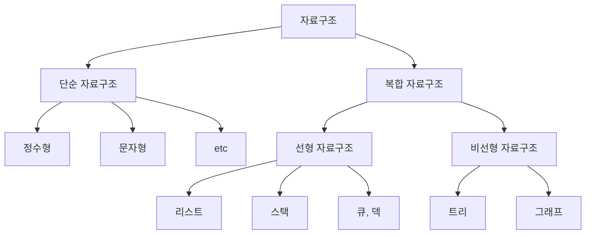

## 1.1 자료구조와 알고리즘

### 자료구조란?

> **자료구조**란 데이터를 효율적으로 저장하고 관리하기 위한 구조적 방식  
  

코딩은 자료(data)를 주로 다루며, 이런 자료를 정리하여 보관하기 위해 여러 가지 구조들이 사용됩니다.  
이를 **자료 구조(data structure)**라고 합니다.


> **예시**  
> 접시를 쌓아서 관리하는 구조? **➔ Stack**  
> 맛집의 줄서기 방식? **➔ Queue**  
> 친구 목록? **➔ List**  
> 조직도 **➔ Tree**  
> 지하철 노선도? **➔ Graph**  
{: .prompt-info}

위 예시들처럼, **자료구조**는 자료의 특성에 따라 <u><em>효율적인 정리 규칙</em></u> 을 찾아 정리하고, <u><em>저장 및 처리</em></u> 하는 모든 작업을 다룹니다.

#### 자료구조의 분류 


자료구조는 크게 **단순 자료구조**와 **복합 자료구조**로 나눌 수 있습니다. 이름처럼 **단순 자료구조**는 숫자나 문자와 같은 단순한 자료를 저장하는 구조이고, **복합 자료구조**는 여러 개의 단순 자료를 한꺼번에 보관하는 구조입니다.  
**복합 자료구조**는 다시 **선형 자료구조**(linear)와 **비선형 자료구조**(non-linear)로 나눌 수 있습니다.   
<br>
**선형 자료구조**는 자료들을 <u>일렬로 나열하여 저장</u>하는데, 자료들 사이에 <u>순서</u>가 존재합니다.  
**비선형 자료구조**는 한 줄로 세우기 어려운 <u>복잡한 관계</u>의 자료들을 표현할 수 있습니다.  
<br>
모든 자료구조는 배열을 이용하거나 연결된 구조로 구현할 수 있습니다. 
<br>
컴퓨터의 가장 대표적인 응용 분야는 정렬과 탐색입니다.
**정렬**은 주어진 데이터 집합을 특정 기준에 맞게 순서대로 나열하는 작업이며, **탐색**은 주어진 데이터 집합에서 특정 값을 찾는 작업입니다.  
정렬과 탐색을 효율적으로 수행하기 위해서는 적절한 자료구조를 사용하는 것이 매우 중요합니다. 가령, 정렬된 배열에서는 이진 탐색을 활용하면 O(log n)의 시간 복잡도로 탐색할 수 있지만, 정렬되어 있지 않은 배열에서는 선형 탐색을 사용하므로 O(n)의 시간 복잡도가 필요합니다.  

> **이진 탐색 시간 복잡도 추가 설명**  
> 매번 실행할 때마다 1/2씩 사이즈가 줄어듭니다.  
> 몇 번만에 사이즈가 1이 되는지 찾으면 그게 곧 시간 복잡도가 됩니다.  
> input size를 N이라고 했을 때, N을 k번 2로 나눴을 때 1이 됩니다.  
> 즉, N은 2의 k제곱이 되고, log를 활용해 정리하면 k는 밑이 2인 log N이 됩니다.  
> 이를 점근적 표기법으로 표현하면 O(log N)이 되는 것입니다.  
{: .prompt-tip }

### 알고리즘이란?
대부분의 컴퓨터 프로그램은 어떤 데이터를 처리하고 그 결과를 제공합니다.
이때 데이터는 자료구조를 이용하여 표현되고, 이를 이용해 주어진 문제를 처리하기 위한 효과적인 절차가 필요한데, 이를 **알고리즘(algorithm)**이라고 합니다.  
예를 들어 영어 사전에서 특정한 단어를 찾는 방법(알고리즘)을 알아보겠습니다.  
- 방법 1: 사전의 첫 페이지부터 차레대로 읽어가며 찾기
- 방법 2: 사전의 단어들이 알파벳순으로 정렬되어 있으므로, 첫 알파벳 글자를 기준으로 페이지를 나누어 찾기  

단어들이 배열에 저장되어 있다면 배열이 자료구조에 해당하고, 찾는 위 두 가지 방법이 알고리즘이 됩니다.  
당연하게도 방법 2가 더 좋은 알고리즘인데, 이 경우를 통해 더 복잡한 자료구조를 사용하면 더 좋은 알고리즘을 사용할 수 있다는 것을 알 수 있습니다.

#### 알고리즘의 조건  
**알고리즘**은 주어진 문제를 해결하기 위한 <u>논리적인 절차와 방법들</u>을 정리한 것으로, 컴퓨터에서는 <u>특정 작업을 수행하는 명령어들의 집합</u>입니다. 
이 명령어들은 컴퓨터가 실행하는 구체적인 명령들을 의미합니다.  

> **알고리즘의 조건**
> - 입력 : 0개 이상의 입력이 존재  
> - 출력 : 1개 이상의 출력이 존재  
> - 명백성 : 각 명령어의 의미는 모호하지 않고 명확  
> - 유한성 : 한정된 수의 단계 후에는 반드시 종료  
> - 유효성 : 각 명령어들은 실행 가능한 연산  
{: .prompt-info }

#### 알고리즘의 기술 방법  
1. 자연어  
2. 흐름도(flowchart)  
3. 의사코드(pseudocode)  
4. 특정 프로그래밍 언어  

## 1.2 추상 자료형  
### 추상 자료형(Abstract Data Type, ADT)이란?  
> **추상 자료형**이란 개발자가 추상적으로 정의한 자료형으로, 자료구조가 어떤 자료를 다루는지 그리고 이들에 대해 어떤 연산이 제공되는지 기술  

> **예시 - Bag의 추상 자료형**  
> 데이터 : 지갑, 휴대폰 등 여러 가지 물건을 넣을 수 있음.(동일한 물건 가능)  
>연산 : insert(), remove(), contains(), count() 등  
{: .prompt-info }

위 예시처럼 데이터와 연산이 정해지면 추상 자료형을 정의할 수 있습니다. 
추상 자료형은 사용자 프로그램에게는 인터페이스(Interface)만 제공하고, 내부 구현은 숨기는 특징이 있습니다. 
즉, 사용자는 Bag의 연산들이 어떻게 구현되었는지를 몰라도 Bag를 쉽게 사용할 수 있다는 의미입니다.  

추상 자료형은 일반 함수보다는 클래스로 구현하는 것이 바람직합니다. 
추상 자료형의 데이터와 연산이 클래스의 상태(state)와 행위(behavior)에 정확히 대응되기 때문입니다. 

## 1.3 알고리즘의 성능 분석  
### 알고리즘의 실행시간 측정  

알고리즘의 효율성은 <u>계산속도</u>와 <u>메모리 사용량</u>으로 평가가 가능합니다. 
즉, 좋은 알고리즘은 실행시간이 짧으면서 메모리와 같은 컴퓨터의 자원들을 적게 사용하는 것입니다. 
일반적으로 실행시간이 메모리 공간보다 더 중요하게 인식되므로 <u>실행시간을 효율적인 알고리즘의 기준</u>으로 삼습니다. 
이러한 알고리즘의 효율성은 자료들을 어떤 구조로 관리하는지, 즉 사용하는 자료구조에 따라 큰 영향을 받습니다.  

알고리즘의 효율성을 판단하는 가장 확실한 방법은 알고리즘을 구현하여 실제로 컴퓨터로 실행시켜, 실행시간을 측정하는 것입니다. 
이때, `import time` 모듈을 사용하기도 합니다.  

> **Python module이란?**  
> 모듈(module)은 Python 코드가 들어 있는 하나의 .py 파일  
> Python은 많은 기본 모듈을 제공하며, 이들은 설치 없이 바로 사용 가능. 이를 표준 라이브러리(standard library)라고도 부름  
> Python의 모듈들은 결국 C로 작성된 라이브러리들로, Python이 C로 작성된 라이브러리를 호출하는 방식으로 동작  
> 내장된 기본 모듈 외에는 pip 명령을 통해 PyPI(Python Package Index)라는 공식 저장소에서 필요한 패키지를 설치  
{: .prompt-tip }

### 알고리즘의 복잡도 분석이란?  
알고리즘의 **복잡도 분석(complexity analysis)**은 구현하지 않고 알고리즘의 효율성을 평가하는 방법입니다. 
처리시간을 직접 측정하는 것이 아니라 <u>알고리즘의 연산 횟수를 대략적으로 계산</u>하는데, 더 많은 연산이 필요하면 더 복잡한 알고리즘이 됩니다.  

알고리즘의 복잡도를 계산하기 위해서는 먼저 얼마나 많은 연산이 실행되는지를 계산해야 합니다. 
보통 이러한 <u>연산들의 실행 횟수는 입력의 크기 n에 대한 함수</u> 형태, 즉 <em>T(n)</em> 으로 나타나는데, 이를 **복잡도 함수**라고 합니다.  

두 가지 예시 코드에 대해 복잡도 함수를 구해보겠습니다.  
```python
# 반복문을 이용해 숫자를 하나씩 더하기 
calc_sum(n):
    sum = 0
    for i in range(1, n+1):
        sum += i
    return sum
```

위 코드의 경우, 3행에서 대입 연산(sum = 0)이 1회 실행됩니다. 또한, 5행(sum += i)은 반복문(for) 내부에 있어 n번 수행되며, 대입 연산과 덧셈 연산이 한 번씩 수행됩니다.(4행의 반복 제어와 6행의 결과 반환 연산은 전체 복잡도에 영향을 미치지 않으므로 무시)  
결국, 3행과 5행의 연산들의 실행 횟수를 모두 합하면 2n + 1이 되고, 이 알고리즘의 복잡도 함수 <em>T(n)</em>=2n+1이 됩니다.  

```python
# 합 공식으로 1부터 n까지 합을 구함
calc_sum(n):
   sum = n*(n+1)/2
   return sum
```
위 코드의 경우 3행에서 대입, 곱셉, 덧셈, 나눗셈 연산이 각각 1회씩 수행됩니다.  
결국, 4행을 제외하면 총 4번의 연산이 필요하며, 이 알고리즘의 복잡도 함수는 <em>T(n)</em>=4가 됩니다.  
<br>
즉, n이 커질수록 첫 번째 알고리즘보다 두 번째 알고리즘이 효율적임을 알 수 있습니다.  

> **연산들의 속도 차이**  
> 일반적으로는 나눗셈과 곱셈이 덧셈이나 뺄셈보다 시간이 오래 걸립니다.  
> 하지만, 시스템에 따라 그렇지 않은 경우도 있습니다.  
> 이러한 연산들의 상대적인 처리시간 차이는 알고리즘 복잡도를 분석하는 데는 중요하지 않으므로, 같은 시간이 소요된다고 가정해도 무관합니다.  
{: .prompt-tip }


### 복잡도의 점근적 표기 
알고리즘의 복잡도는 흔히 더 간단한 형태로 단순화시켜 사용합니다. 
예를 들어, 2n+1이 아니라 n이라고 표현하며, <em>T(n)</em>이 8n<sup>2</sup> + 2n + 17 이면 n<sup>2</sup>이라고 표현합니다.  
이렇게 해도 무관한 이유는 n이 커질수록 큰 계수들의 영향이 미미해지고, 최고차항(n<sup>2</sup>)을 제외한 나머지 항의 영향도가 크게 줄어들기 때문입니다. 
만약 <em>n이 무한대에 가까워지면 최고차항을 제외한 나머지 항의 효과는 거의 없는 것</em>이나 마찬가지입니다. 
이런 이유에서 알고리즘의 복잡도를 설명할 때 <em>최고차항만을 계수 없이 취해 단순하게 표현하는 방법</em>을 사용합니다. 
이러한 방식은 "정확히 몇 번의 연산이 필요한가?"가 아니라 "연산량이 얼마나 빨리 증가하는가?"만을 나타내는데, 즉, 증가 가속도만을 표현한 것입니다. 
이러한 표현 방법을 **점근적 표기법(asymptotic notation)**이라고 합니다. 
점근적 표기에 상한과 하한 및 동일 등급과 같은 개념을 적용하면 빅오, 빅오메가와 빅세타 표기로 나눠집니다.  

#### 빅오(Big-O) 표기법  
빅오 표기법은 알고리즘의 복잡도를 *O(g(n))* 과 같이 나타내는데, 이것은 증가속도가 *g(n)* 이하인 모든 복잡도 함수를 모두 포함합니다. 
즉, 빅오는 처리시간의 상한(upper bound)을 의미합니다.  
예를 들어, O(n<sup>2</sup>)은 어떤 경우에도 n<sup>2</sup>에 비례하는 시간 안에는 반드시 완료된다는 의미입니다.  

> **빅오(Big-O) 예시**  
> 3n<sup>2</sup> + 4n <strong>➔ <em>O(n<sup>2</sup>)</em></strong>  
> 2n - 3 <strong>➔ <em>O(n<sup>2</sup>)</em></strong>  
> 2n(n + 1) <strong>➔ <em>O(n<sup>2</sup>)</em></strong>  
> 0.000001n<sup>3</sup> <strong>➔ <em>O(n<sup>3</sup>)</em></strong>  
> 1000<sup>n</sup> <strong>➔ <em>O(n!)</em></strong>  
{: .prompt-info }

> **2n - 3이 O(n<sup>2</sup>)이 가능한 이유**  
> Big-O 표기법 정의에 따라 2n - 3은 증가속도가 n<sup>2</sup>과 같거나 낮은 복잡도 함수입니다.  
> 즉, <em>O(n)</em> 이라 표기하는게 정석이지만, <em>O(n<sup>2</sup>)</em> 으로 표기했다고해서 틀린 것은 아니라는 의미입니다.  
{: .prompt-tip }

#### 빅오메가(Big-omega) 표기법
<strong><em>&Omega;(g(n))</em></strong> 은 증가속도가 *g(n)* 이상인 모든 복잡도 함수를 포함합니다. 
즉, 빅오메가는 복잡도 함수의 하한(lower bound)을 의미합니다.  
예를 들어, &Omega(n<sup>2</sup>)은 아무리 빨라도 n<sup>2</sup> 이상의 시간이 반드시 걸린다는 의미입니다.  

#### 빅세타(Big-Theta) 표기법  
<strong><em>&Theta;(g(n))</em></strong> 은 증가속도가 *g(n)* 과 같은 복잡도 함수만을 포함합니다. 
즉, 빅세타는 상한인 동시에 하한인 경우를 의미합니다.  

> **적절한 표기법 선택 전략**  
> 시간 복잡도를 정확히 계산할 수 있다면? **➔ 빅세타 표기법**  
> 시간 복잡도를 정확히 계산하기 어렵다면? **➔ 빅오 표기법 또는 빅오메가 표기법**  
> 일반적으로 최악의 상황을 고려한 해결책을 찾기 때문에 **빅오 표기법**이 주로 사용됩니다.(단, 최소 차수로 상한을 표시한다고 가정) 
{: prompt-tip}

O(1) < O(log n) < O(n) < O(n log n) < O(n<sup>2</sup>) < O(n<sup>3</sup>) < O(2<sup>n</sup>) < O(3<sup>n</sup>) < O(n!)  
- 상수형인 O(1)은 n이 변하더라도 항상 일정한 시간에 처리되는 가장 빠른 알고리즘  
- O(n)은 n에 비례하는 시간이 걸리기 때문에 선형시간이라 부릅니다.  
- O(2<sup>n</sup>)은 지수형  
- O(n!)은 팩토리얼형  
    - O(2<sup>n</sup>)과 O(n!)은 n이 커질수록 처리시간이 급격히 증가하는 알고리즘입니다.  
    - 현실적이지 않은 가장 나쁜 알고리즘이라 평가받습니다.  

### 입력 데이터에 따른 성능 차이  
같은 알고리즘도 입력의 종류에 따라 다른 실행시간을 보일 수 있습니다.  

> **입력레 따른 성능 차이 원인**  
> 1. 조건 분기와 반복 횟수의 차이
> 2. 알고리즘 내부의 최적화 가능성 - <u>퀵 정렬의 경우, 입력이 정렬된 배열일 경우 정렬에 많은 시간 소요</u>
> 3. 캐시와 메모리 접근 효율 - <u>입력 데이터 크기나 배열의 배치 방식에 따라 CPU 캐시 히트율이 달라져 실행 속도에 영향(연속된 메모리 접근 = 빠름, 랜덤한 접근 = 느림)</u>
> 4. 알고리즘의 조건에 따른 조기 종료
> 5. 입력의 구조적 특성 - <u>중복이 많은 입력, 정렬된 입력, 랜덤한 입력 등에 따라 알고리즘이 다르게 반응</u>
{: .prompt-tip }

- **최선의 경우(best case)** 
    - 알고리즘이 *가장 빠르게 종료* 되는 경우로, 최적의 성능을 보이는 경우입니다.  
    - 예를 들어, 정렬된 배열에서 이진 탐색을 수행할 때, 찾고자 하는 값이 중간값인 경우입니다.  
- **평균의 경우(average case)**
    - 알고리즘이 *평균적으로 종료* 되는 경우로, 일반적인 성능을 보이는 경우입니다.  
    - 예를 들어, 정렬된 배열에서 이진 탐색을 수행할 때, 찾고자 하는 값이 배열의 중간에 있는 경우입니다.  
- **최악의 경우(worst case)**
    - 알고리즘이 *가장 느리게 종료* 되는 경우로, 최악의 성능을 보이는 경우입니다.  
    - 예를 들어, 정렬된 배열에서 이진 탐색을 수행할 때, 찾고자 하는 값이 배열의 끝에 있는 경우입니다.  

대부분의 경우 알고리즘에 최대한 불리한 입력 데이터를 사용하는 <u>최악의 경우의 실행시간이 가장 중요</u>합니다.  

### 복잡도 분석의 예  
리스트(배열)의 처음부터 끝까지 차례대로 값을 하나씩 비교하면서, 찾고자 하는 값을 탐색하는 알고리즘을 순차 탐색이라고 합니다.  
해당 알고리즘을 다음과 같이 파이썬으로 구현하고, 복잡도를 분석해보겠습니다.  

```python
# 순차 탐색 함수
def search(A, key): # 배열 A에서 key인 항목의 위치를 찾는 함수  
   n = len(A) # 알고리즘의 입력 크기는 배열 A의 크기  
   for i in range(n): # i에 0부터 n-1까지 순서대로 대입  
      if A[i] == key: # key인 항목을 찾으면 인덱스 i 반환
         return i 
      return -1 # key가 없으면(탐색 실패) -1 반환  
```  

복잡도 분석을 위해서는 먼저 **입력의 크기**와 가장 많이 수행되는 **기준 연산**을 찾아야 합니다.  
- 4행의 반복문은 배열의 크기만큼 수행됩니다. 따라서 **입력의 크기**는 <u>배열의 크기(n)</u>입니다.  
- 3행은 n과 상관없이 한번만 실행됩니다. 
- 6행과 7행도 조건이 되는 경우메만 한 번 실행됩니다.  
- 5행은 for문이 반복될 때마다 한 번씩 수행됩니다. 따라서 5행의 `==` 연산의 수행 횟수를 기준으로 복잡도를 분석하면 됩니다.  

순차 탐색 함수는 입력의 크기가 같더라도 입력의 구성이 다르면 처리시간이 달라지는 알고리즘입니다. 즉, 최선, 최악, 평균의 효율성이 서로 다릅니다.  
- 최선의 경우 : 첫 번째 항목이 key와 같은 경우로, 항상 한번 만에 탐색이 완료되는 경우입니다.  
- 최악의 경우 : key가 리스트에 없거나 맨 뒤에 있는 경우로, 모든 항목을 검색해야 하므로 n번 비교해야 하는 경우입니다.  
- 평균적인 경우 : 무엇이 평균"인가에 대한 정의가 명확하지 않기 때문에 계산하기 어렵습니다.  

> 결국, 순차 탐색의 시간 복잡도는 최선의 경우 O(1), 최악이나 평균적인 경우 O(n)입니다.  
> 평균적인 경우가 좋아 보이지만 "평균"에 대한 가정이 필요하고 계산이 어려운 경우가 많아 자주 사용되지 않습니다.  

## 1.4 시간 복잡도 분석: 순환 알고리즘  
같은 일을 되풀이하는 방법으로 for나 while과 같은 반복문을 이용할 수도 있지만, 순환(또는 재귀)라는 기법을 사용할 수 있습니다.  

### 순환이란?  
**순환(recursion)**이란 어떤 함수가 자기 자신을 다시 호출하여 문제를 해결하는 프로그래밍 기법입니다. 이 기법은 문제 해결을 위한 독특한 구조를 제공하며, 많은 효율적인 알고리즘들에서 사용되는 매우 중요한 개념입니다.  
순환은 문제 자체가 순환적이거나(예: 팩토리얼 계산, 피보나치 수열, 이진 탐색, 하노이 탑 등) 순환적으로 정의되는 자료구조(예: 이진트리 등)를 다루는 프로그램에 적합합니다.  
<br>
예시로, 자연수 1부터 n까지의 곱을 구하는 팩토리얼(Factorial) 문제를 살펴보겠습니다.  
n!은 1·2·3····n과 같이 반복적(iterative)인 구조로 정의할 수 있습니다.  
n!은 (n-1)!에 n을 곱한 것으로 정의할 수 있는데, 이는 순환적(recursive)인 구조로 정의한 것입니다.  

#### 반복 구조(iterative)의 팩토리얼 함수  
```python
def factorial_iter(n) : 
   result = 1
   for k in range(1, n+1) : # k에 1부터 n까지 순서대로 대입
      result = result * k # 매 반복에서 곱셈과 대입 연산이 각각 한 번씩 수행됨 
   return result
```
반복 구조는 시간 복잡도를 구하는 것도 간단한데, 3행의 반복 루프가 n번 반복하므로 4행의 곱셈이나 대입 연산이 각각 n번 반복됩니다. 따라서 시간 복잡도는 O(n)입니다. 

#### 순환 구조(recursive)의 팩토리얼 함수  
```python
def factorial(n):
   if n == 1: # 순환 호출을 멈추는 부분. 반드시 필요. n이 1이면 순환 호출을 하지 않고 1 반환
      return 1
   else: # 자신을 순환적으로 호출하는 부분. 호출을 할 때마다 문제의 크기가 줄어들어야 함. 이 코드에서는 n이 n-1로 줄어듦.
      return n*factorial(n-1)
```
순환 함수는 자신을 <u>순환적으로 호출하는 부분</u>과 <u>순환 호출을 멈추는 부분</u>으로 구성되어 있습니다. 
만약 순환 호출을 멈추는 부분이 없다면 시스템 스택을 다 사용할 때까지 순환적으로 호출되다가 결국 오류를 내면서 멈출 것입니다. 
5행의 곱셈을 기준으로 하면, 함수를 한번 호출할 때마다 1번의 곱셈이 수행되고, 전체 순환 호출은 n번이 발생하므로, 시간 복잡도는 O(n)입니다.  

> **시스템 스택이란?**  
> 시스템 스택은 프로그램 실행 중 함수 호출 정보를 저장하는 메모리 영역인 <strong>Call Stack</strong>을 의미합니다.  
> 즉, 함수가 호출될 때마다 스택에 쌓이고, 호출이 끝나면 제거되는데, 순환 호출에서 종료 조건 없이 계속 함수가 호출되면 스택이 가득 차서 <strong>Overflow</strong>가 발생합니다.  
{: .prompt-tip } 

#### 순환 ⇔ 반복  
많은 경우 순환과 반복을 서로 변환할 수 있습니다. 그러나 실행속도 면에서는 함수 호출의 부담이 있고, 시스템 스택을 많이 사용하기 때문에 순환이 반복보다 느린 경우가 많습니다. 
하지만 트리와 같은 특정 문제에서는 순환이 반복보다 명확하고 간결하게 코딩이 가능합니다. 이진 탐색이나 퀵 정렬 등의 알고리즘에서 흔히 사용됩니다.  

### 순환은 복잡한 문제를 쉽게 해결 가능: 하노이탑  
> **문제 설명**  
> 막대 A에 쌓여있는 n개의 원판을 모두 C로 옮겨라. 단, 다음 조건을 만족해야 한다.  
> - 한 번에 하나의 원판만 옮길 수 있다.  
> - 맨 위에 있는 원판만 옮길 수 있다.  
> - 크기가 작은 원판 위에 큰 원판을 쌓을 수는 없다.  
> - 중간 막대 C를 임시 막대로 사용할 수 있지만 앞의 조건은 지켜야 한다.  

순환 알고리즘은 함수를 호출할수록 문제의 크기가 반드시 작아져야 하는데, 하노이탑에서 문제의 크기는 이동해야 하는 원판의 수입니다. 
n개의 원판을 A에서 C로 옮기는데 순환을 어떻게 적용할 수 있는지 살펴보겠습니다.  
<br>
- 1단계 : A에 있는 n-1개의 원판을 C를 임시 막대로 이용해서 B로 이동  
- 2단계 : A에 남은 하나의 원판을 C로 이동  
- 3단계 : B에 있는 n-1개의 원판을 A를 임시 막대로 이용해서 C로 이동  
<br>  
순환 함수에서는 매개변수가 중요한데, 문제마다 원판의 개수와 시작 막대, 임시 막대, 목표 막대가 달라지므로 이들을 매개변수로 전달해야 합니다. 
원판의 개수를 n, 시작 막대를 fr, 임시 막대를 tmp, 목표 막대를 tmp로 하고 구현한 코드는 다음과 같습니다.  

```python
def hanoi_tower(n, fr, tmp, to): # fr에 있는 n개의 원판을 tmp를 이용해 to로 이동하는 함수 
   if n==1 : # n이 1이면 바로 이동하면 됨. 종료 조건 
      print("원판 1: %s --> %s" % (fr, to))
   else:
      hanoi_tower(n-1, fr, to, tmp) # 1단계
      print("원판 %d: %s --> %s" % (n, fr, to)) # 2단계
      hanoi_tower(n-1, tmp, fr, to) # 3단계 
```

### 심화 학습: 순환 알고리즘의 복잡도  
순환 알고리즘의 복잡도를 계산하는 과정은 **입력의 크기**와 가장 많이 수행되는 **기준 연산**을 찾는 것으로 반복 알고리즘의 경우와 동일합니다. 
위 `hanoi_tower` 함수의 경우, **입력의 크기**는 옮겨야 하는 원판의 개수 n이고, **기준 연산**은 원판을 이동하는 3행과 6행의 print()로 하면 됩니다.  

문제는 복잡도 함수를 구하는 과정입니다. 
n개를 옮기는 문제에 대한 시간 복잡도 함수를 T(n)이라고 하겠습니다. 
`hanoi_tower` 코드를 보면, n개를 옮기려면 n-1개를 두 번 옮기고(5행, 7행) 원판 하나를 추가로 옮겨야(6행) 합니다. 
따라서 *T(n) = 2T(n-1) + 1* 이 됩니다.  
이러한 점화식은 다음과 같이 전개할 수 있습니다.  
T(n) = 2T(n-1) + 1  
     = 2(2T(n-2) + 1) + 1
     = 4T(n-2) + 2 + 1
     = 4(2T(n-3) + 1) + 2 + 1
     = 8T(n-3) + 4 + 2 + 1
     = ...
     = 2<sup>k</sup>T(n-k) + 2<sup>k-1</sup> + ... + 2 + 1  

이때, 앞선 `hanoi_tower` 함수의 종료 조건인 n=1일 때 T(1)=1이므로, 위 식에서 k=n-1을 대입하면 2<sup>n</sup> - 1 이 됩니다.  
따라서, 최종 시간 복잡도는 O(2<sup>n</sup>)임을 알 수 있습니다.  

| 종류 | 설명 |
|:----:|------|
| **신분관계** | 성명, 주민등록번호, 주소, 본적, 가족관계, 본관 등 |
| **내면의 비밀** | 사상, 신조, 종교, 가치관, 정치적 성향 등 |
| **심신의 상태** | 건강상태, 신장, 체중 등 신체적 특징, 병력, 장애정도 등 | 
| **사회 경력** | 학력, 직업, 자격, 전과 여부 등 |
| **경제관계** | 소득규모, 재산보유상황, 거래내역, 신용정보, 채권채무관계 등 |
| **새로운 유형** | 생체인식정보(지문, 홍채, DNA 등), 위치정보 등 |